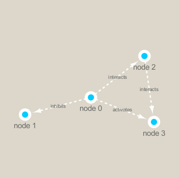

```{r setup, include=FALSE}
knitr::opts_chunk$set(echo = TRUE)
```

## Setup
First seup the pacakges we need. These include **igraph** from CRAN and **RCy3** from bioconductor

I installed these with **install.packages("igraph")**
**BiocManger::install("RCy3")**.
```{r}
library(RCy3)

```

```{r}
#Test the connection to Cytoscape
cytoscapePing()
# Check the version
cytoscapeVersionInfo()
```

```{r}
g <- makeSimpleGraph()
createNetworkFromGraph(g, "myGraph")

fig <- exportImage(filename="demo", type="png", height=350)


```

# Switch Styles 
plat with representation 
```{r}
setVisualStyle("Marquee")
```
save iamge from cytoscape and include it in my report here:
```{r}
fig <- exportImage(filename="demo_marquee", type="png", height=350)


```
```{r}
styles <- getVisualStyleNames()
styles
```

we can also plot this simple network in R itself 
```{r}
plot(g)
```

# Read our metagenomics data 
Our data from today comes from the TARA ocean study.
```{r}
## scripts for processing located in "inst/data-raw/"
prok_vir_cor <- read.delim("virus_prok_cor_abundant.tsv", stringsAsFactors = FALSE)

## Have a peak at the first 6 rows
head(prok_vir_cor)
```
how many connections (i.e. edges) will we have in our network - lets llok at the number of rows
```{r}
nrow(prok_vir_cor)
```

```{r}
library(igraph)
g <- graph.data.frame(prok_vir_cor, directed = FALSE)
plot(g)
```
This default plot is a hot mass!!
Lets turn the node/vertex labes off and turn the size of the vertex/nodes down a little 
```{r}
plot(g, vertex.size=3, vertex.label=NA)

```
To send this network to Cytoscape we can use the command:

```{r}
createNetworkFromIgraph(g,"myIgraph")
```

## Network community detection

Community structure detection algorithms try to find dense sub-graphs within larger network graphs (i.e. clusters of well connected nodes that are densely connected themselves but sparsely connected to other nodes outside the cluster) . Here we use the classic Girvan & Newman betweenness clustering method. The igraph package has lots of different community detection algorithms (i.e. different methods for finding communities).

Lets cluster our network to find "community" structure 
```{r}
cb <- cluster_edge_betweenness(g)
```
```{r}
cb
plot(cb, y=g, vertex.label=NA,  vertex.size=3)
```

## Centrality analysis
Centrality gives an estimation on how important a node or edge is for the connectivity (or the information flow) of a network. It is a particularly useful parameter in signaling networks and it is often used when trying to find drug targets for example.

Centrality analysis often aims to answer the following question: Which nodes are the most important and why?

One centrality method that you can often find in publications is the Google PageRank score. For the explanation of the PageRank algorithm, see the following webpage: http://infolab.stanford.edu/~backrub/google.html

```{r}
pr <- page_rank(g)
head(pr$vector)
```

```{r}
# Make a size vector btwn 2 and 20 for node plotting size

v.size <- BBmisc::normalize(pr$vector, range=c(2,20), method="range")
plot(g, vertex.size=v.size, vertex.label=NA)
```

```{r}
v.size <- BBmisc::normalize(d, range=c(2,20), method="range")
plot(g, vertex.size=v.size, vertex.label=NA)
```

```{r}
b <- betweenness(g)
v.size <- BBmisc::normalize(b, range=c(2,20), method="range")
plot(g, vertex.size=v.size, vertex.label=NA)

```

