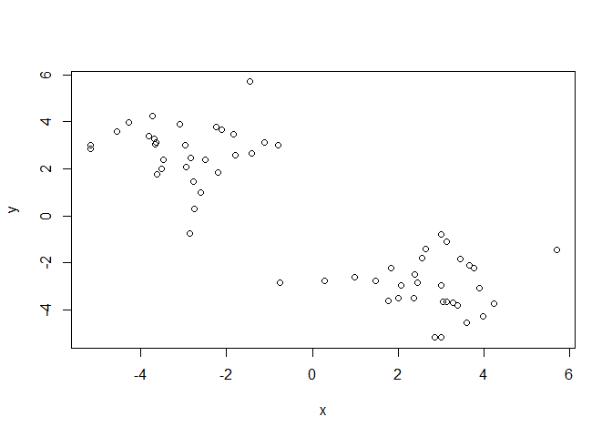
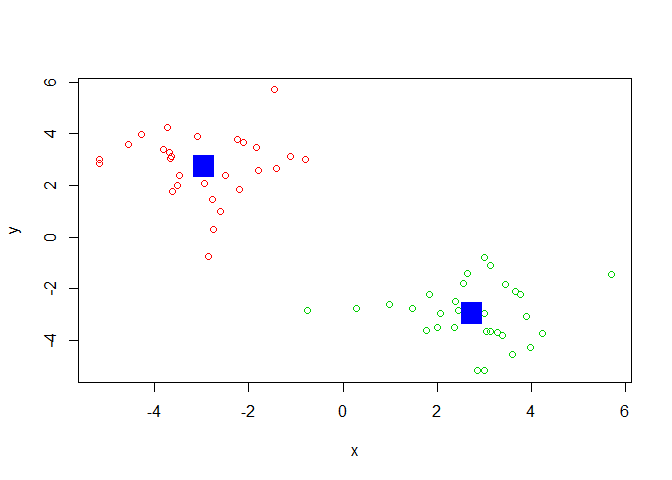
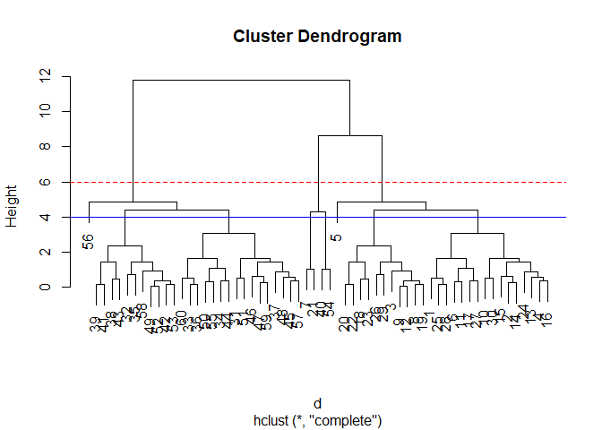
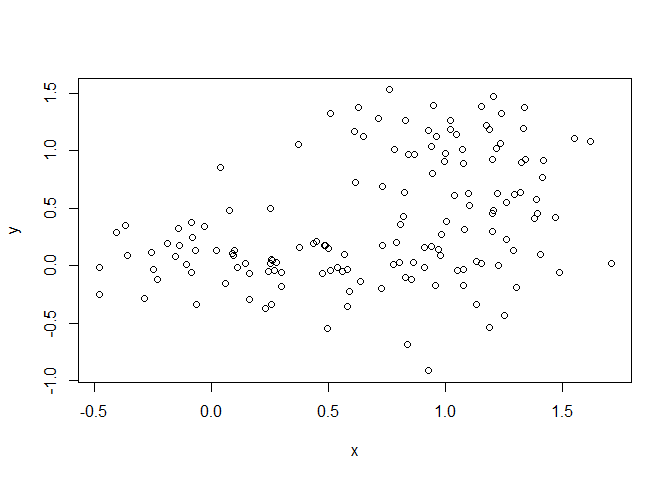
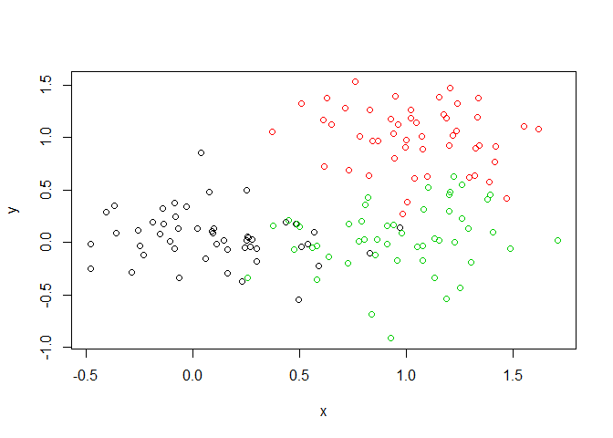
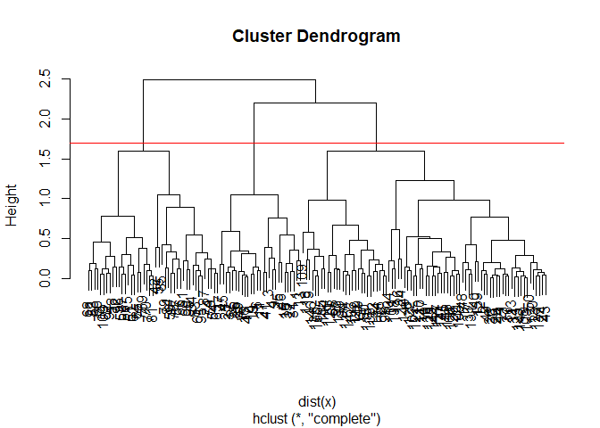
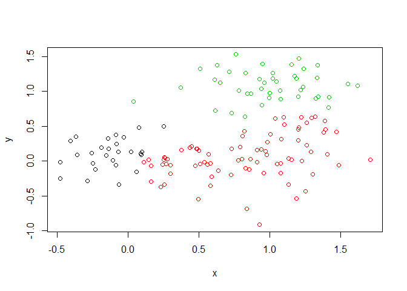
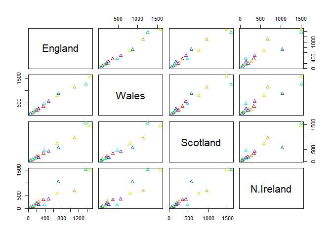
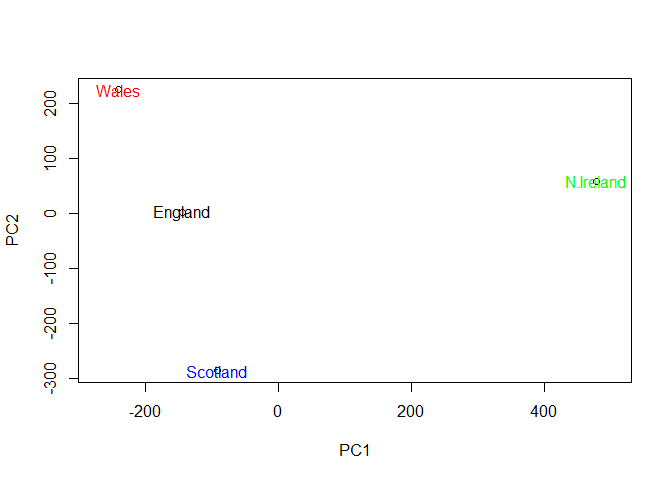

class09
================
DongSu Kim
2/4/2020

\#class 09 ; k-mean clustering The main k-means function in R is called
‘kmeans()’.

``` r
tmp <- c(rnorm(30,-3), rnorm(30,3))
x <- cbind(x=tmp, y=rev(tmp))
plot(x)
```

<!-- --> Use the
kmeans() function setting k to 2 and nstart=20

Inspect/print the results

``` r
km <- kmeans(x, centers=2, nstart=20)
km
```

    ## K-means clustering with 2 clusters of sizes 30, 30
    ## 
    ## Cluster means:
    ##           x         y
    ## 1 -2.958320  2.740872
    ## 2  2.740872 -2.958320
    ## 
    ## Clustering vector:
    ##  [1] 1 1 1 1 1 1 1 1 1 1 1 1 1 1 1 1 1 1 1 1 1 1 1 1 1 1 1 1 1 1 2 2 2 2 2 2 2 2
    ## [39] 2 2 2 2 2 2 2 2 2 2 2 2 2 2 2 2 2 2 2 2 2 2
    ## 
    ## Within cluster sum of squares by cluster:
    ## [1] 79.91861 79.91861
    ##  (between_SS / total_SS =  85.9 %)
    ## 
    ## Available components:
    ## 
    ## [1] "cluster"      "centers"      "totss"        "withinss"     "tot.withinss"
    ## [6] "betweenss"    "size"         "iter"         "ifault"

Q. How many points are in each cluster? -\> 30 points for each cluster

``` r
#cluster size
km$size
```

    ## [1] 30 30

``` r
#cluster assignment and membership 
km$cluster
```

    ##  [1] 1 1 1 1 1 1 1 1 1 1 1 1 1 1 1 1 1 1 1 1 1 1 1 1 1 1 1 1 1 1 2 2 2 2 2 2 2 2
    ## [39] 2 2 2 2 2 2 2 2 2 2 2 2 2 2 2 2 2 2 2 2 2 2

``` r
length(km$cluster)
```

    ## [1] 60

``` r
table(km$cluster)
```

    ## 
    ##  1  2 
    ## 30 30

Q. What ‘component’ of your result object details - cluster size?
-\>30,30 - cluster assignment/membership? -\> - cluster center? -\> k=2

``` r
# plot x colored by the kmenas cluster assignment 
plot(x, col=km$cluster+1)

#plot x adding cluster cneters as blue point 
points(km$centers, col="blue", pch=15, cex=3 )
```

<!-- -->

Plot x colored by the kmeans cluster assignment and add cluster centers
as blue points

\#\# Hierarchiacal clustering in R

The main Hiererchaicl clustering functin in R is called ‘hclust()’

An important point here is that you have to calculate the distance
matrix your input data before calling ‘hclust()’.

``` r
# we will use our x again from above ... 
#calculate the distance matrix first 
d <- dist(x)
hc <- hclust(d)
hc
```

    ## 
    ## Call:
    ## hclust(d = d)
    ## 
    ## Cluster method   : complete 
    ## Distance         : euclidean 
    ## Number of objects: 60

Folks often viuew the result of Hierarchical clustering graphicaly, lets
try passing this to the ‘plot()’ function.

``` r
plot(hc)
abline(h=6, col="red", lty =2 )
abline(h=4, col="blue", lty=1)
```

<!-- --> the cluster
1 shows that 1-30 and cluster 2 shows 31-60 in the dendrogram

# To get cluster membership vector I need to “cut” the tree at a certain height to yield my seperate cluster branches

``` r
cutree(hc, h=6)
```

    ##  [1] 1 1 1 1 1 1 2 1 1 1 1 1 1 1 1 1 1 1 1 1 2 1 1 1 1 1 1 1 1 1 3 3 3 3 3 3 3 3
    ## [39] 3 2 3 3 3 3 3 3 3 3 3 3 3 3 3 2 3 3 3 3 3 3

``` r
gp4 <- cutree(hc, k=6)
table(gp4)
```

    ## gp4
    ##  1  2  3  4  5  6 
    ## 27  1  4 16 11  1

Let’s try with some more real like data…

``` r
# Step 1. Generate some example data for clustering
x <- rbind(
 matrix(rnorm(100, mean=0, sd = 0.3), ncol = 2), # c1
 matrix(rnorm(100, mean = 1, sd = 0.3), ncol = 2), # c2
 matrix(c(rnorm(50, mean = 1, sd = 0.3), # c3
 rnorm(50, mean = 0, sd = 0.3)), ncol = 2))
colnames(x) <- c("x", "y")
# Step 2. Plot the data without clustering
plot(x)
```

<!-- -->

``` r
# Step 3. Generate colors for known clusters
# (just so we can compare to hclust results)
col <- as.factor( rep(c("c1","c2","c3"), each=50) )
plot(x, col=col)
```

<!-- -->

Q. Use the ‘dist()’, ‘hclust()’, ‘plot()’ and ‘cutree()’ functions to
return 2 and 3 clusters

``` r
hc <- hclust(dist(x))
plot(hc)
abline(h=1.7, col="red")
```

<!-- -->

to get cluster membership vectors use ‘cutree()’ and then use ‘table()’
to tabulate up how many memebers in each cluster we have.

``` r
grps <- cutree(hc, k=3)
table(grps)
```

    ## grps
    ##  1  2  3 
    ## 27 80 43

Make a plot with our cluster results

``` r
plot(x, col=grps)
```

<!-- --> There is no
overlapping between two clusters

Q. How does this compare to your known ‘col’ groups?

# PCA data anaylsis (<https://bioboot.github.io/bggn213_W19/class-material/lab-8-bggn213.html>)

We shall say that the 17 food types are the variables and the 4
countries are the observations. This would be equivalent to our samples
and genes respectively from the lecture example (and indeed the second
main example further below).

Lets read this data from the provided UK\_foods.csv input file (note we
placed this file in a data sub-directory within or working R studio
project directory.

``` r
x <- read.csv("UK_foods.csv", row.names = 1 )
x
```

    ##                     England Wales Scotland N.Ireland
    ## Cheese                  105   103      103        66
    ## Carcass_meat            245   227      242       267
    ## Other_meat              685   803      750       586
    ## Fish                    147   160      122        93
    ## Fats_and_oils           193   235      184       209
    ## Sugars                  156   175      147       139
    ## Fresh_potatoes          720   874      566      1033
    ## Fresh_Veg               253   265      171       143
    ## Other_Veg               488   570      418       355
    ## Processed_potatoes      198   203      220       187
    ## Processed_Veg           360   365      337       334
    ## Fresh_fruit            1102  1137      957       674
    ## Cereals                1472  1582     1462      1494
    ## Beverages                57    73       53        47
    ## Soft_drinks            1374  1256     1572      1506
    ## Alcoholic_drinks        375   475      458       135
    ## Confectionery            54    64       62        41

Q1. How many rows and columns are in your new data frame named x? What R
functions could you use to answer this questions?

## Complete the following code to find out how many rows and columns are in x?

``` r
dim(x)
```

    ## [1] 17  4

``` r
nrow(x)
```

    ## [1] 17

``` r
ncol(x)
```

    ## [1] 4

Let’s make some plots to explore our data a bit more

``` r
barplot(as.matrix(x), beside=T, col=rainbow(nrow(x)))
```

<!-- -->

``` r
barplot(as.matrix(x), beside=F, col=rainbow(nrow(x)))
```

<!-- --> A “pairs”
plot can help when we have small datasets like this one but often we are
deaing with data that is too large for

``` r
pairs(x, col=rainbow(10), pch=2)
```

<!-- -->

Principal Component Analysis (PCA) with the ‘prcomp()’ function.

``` r
pca <- prcomp(t(x))
summary(pca)
```

    ## Importance of components:
    ##                             PC1      PC2      PC3       PC4
    ## Standard deviation     324.1502 212.7478 73.87622 4.189e-14
    ## Proportion of Variance   0.6744   0.2905  0.03503 0.000e+00
    ## Cumulative Proportion    0.6744   0.9650  1.00000 1.000e+00

``` r
#pca 
```

What is in my resut object ‘pca’? I can cehck the attibutes

``` r
attributes(pca)
```

    ## $names
    ## [1] "sdev"     "rotation" "center"   "scale"    "x"       
    ## 
    ## $class
    ## [1] "prcomp"

``` r
plot(pca$x[,1], pca$x[,2], xlab="PC1", ylab="PC2", xlim=c(-270,500))
text(pca$x[,1], pca$x[,2], colnames(x), col=c("black","red","blue","green"))
```

<!-- -->
